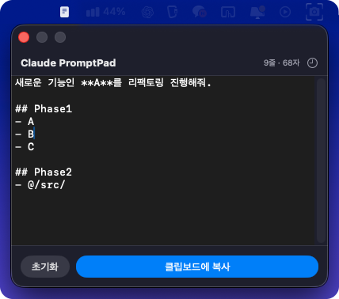
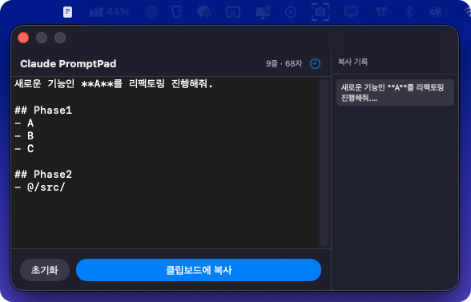

# Claude PromptPad

🌐 **English** | [한국어](README.ko.md)

> Write AI prompts from the macOS menu bar — one shortcut away, no focus switching required.

[](https://www.apple.com/macos/)
[](https://swift.org)
[](../LICENSE)



## Why

Typing prompts directly in the terminal has three recurring pain points:

- **Line breaks** — pressing Return submits the prompt before you're done
- **File paths** — attaching paths inline is awkward and error-prone
- **Korean input** — characters often corrupt or display incorrectly in terminal input

Claude PromptPad solves this by giving you a proper editor in the menu bar. Write the full prompt with line breaks and file paths, then paste it into the terminal in one shot.

## Features

- **Global shortcut** — open the panel from any app without switching focus
- **Floating panel** — always on top, stays visible while you work in other apps
- **Auto-close on copy** — copies to clipboard and dismisses the panel instantly
- **Persistent text** — restores your last prompt after app restarts
- **Customizable shortcut** — bind any key combination from the right-click menu
- **Clipboard history** — keeps the last 10 copied prompts for quick reuse

## UI Overview

| Element | Description |
| ------- | ----------- |
| **Editor** | Monospaced text area for writing prompts |
| **Line count** | Live line count shown in the title bar |
| **Char count** | Live character count shown in the title bar |
| **History toggle** | Clock icon (🕐) in the title bar; opens the history panel to the right |
| **Reset** | Clears the editor in one click |
| **Copy to Clipboard** | Copies text and closes the panel automatically |

## Clipboard History



Click the clock icon in the title bar (or press **Cmd+C** while editing) to save the current prompt to history. The history panel slides open to the right and shows up to 10 recent prompts.

| Behaviour | Detail |
| --------- | ------ |
| **Trigger** | Clicking "Copy to Clipboard" or pressing Cmd+C in the editor |
| **Capacity** | Last 10 entries; oldest entry is dropped when the limit is reached |
| **Deduplication** | Duplicate entries are moved to the top instead of being stored twice |
| **Reuse** | Click any history entry to copy it to the clipboard and close the panel |
| **Dismiss** | Press **ESC** or click the clock icon again to close the history panel |
| **Persistence** | History is kept in memory only — cleared when the app quits |

## Requirements

- macOS 14 (Sonoma) or later
- No external accounts or logins required

## Installation

```bash
git clone https://github.com/cyb9701/claude-tools.git
cd claude-tools/claude-prompt-pad
make install
```

Builds the app and installs it to `~/Applications/Claude PromptPad.app`.

## Shortcut Configuration

Right-click the menu bar icon → **Set Shortcut…** to bind a custom global shortcut.


## Update & Uninstall

```bash
# Update (run from the repo root)
git pull
cd claude-prompt-pad
make update

# Uninstall (run from claude-prompt-pad/)
make uninstall
```

## License

MIT
