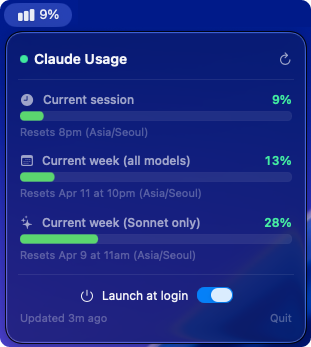

# ClaudeUsageBar

🌐 [English](README.md) | **한국어**

> macOS 메뉴바에서 Claude Pro/Max 사용량을 직접 모니터링하세요.

[](https://www.apple.com/macos/)
[](https://swift.org)
[](../LICENSE)

<!-- Screenshot: 세션 사용량, 주간 통계, Claude Code 오늘 메트릭이 표시된 드롭다운 -->



## 주요 기능

- **로그인 불필요** — Claude Code CLI의 Keychain 토큰을 자동으로 재사용
- **공식 OAuth API** — 화면 스크래핑 없이 공식 인증 방식만 사용
- **경량 네이티브 앱** — SwiftUI + URLSession, Electron 및 WebView 미사용

## 표시 항목

| 항목                      | 설명                                   |
| ------------------------- | -------------------------------------- |
| **현재 세션**             | 5시간 롤링 사용률 (%) + 다음 리셋 시각 |
| **현재 주 (전체 모델)**   | 7일간 모든 모델 사용량                 |
| **현재 주 (Sonnet 전용)** | 7일간 Sonnet 전용 사용량               |
| **Claude Code (오늘)**    | _(선택)_ 토큰 수, 비용 ($), 세션 수    |

## 요구사항

- macOS 14 (Sonoma) 이상
- [Claude Code CLI](https://claude.ai/code) — 설치 및 로그인 완료 상태

## 설치

```bash
git clone https://github.com/cyb9701/claude-tools.git
cd claude-tools/claude-usage-bar
make install
```

`~/Applications/Claude UsageBar.app`에 앱을 빌드하고 설치합니다.

> **Keychain 팝업이 반복적으로 나타나나요?**  
> `make setup-keychain`을 한 번 실행하면 영구적으로 접근 권한이 부여됩니다. macOS 로그인 비밀번호가 필요합니다.

## 선택: Claude Code 사용량 메트릭 활성화

**Claude Code (오늘)** 섹션을 활성화하려면 Claude Code CLI에서 아래 환경 변수를 설정하세요:

```bash
export CLAUDE_CODE_ENABLE_TELEMETRY=1
export OTEL_METRICS_EXPORTER=prometheus
```

Claude Code를 재시작하면 자동으로 해당 섹션이 표시됩니다.

## 업데이트 및 제거

```bash
# 업데이트 (저장소 루트에서 실행)
git pull
cd claude-usage-bar
make update

# 제거 (claude-usage-bar/ 에서 실행)
make uninstall
```

## 라이선스

MIT
